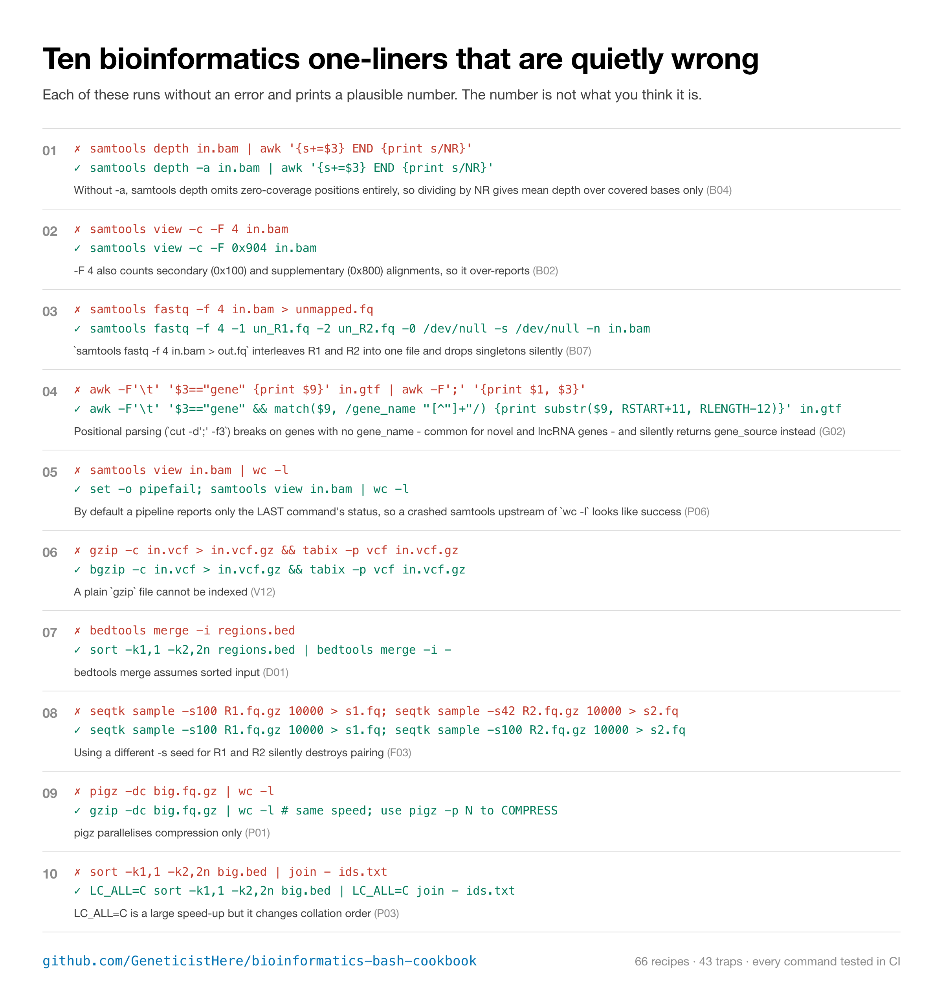
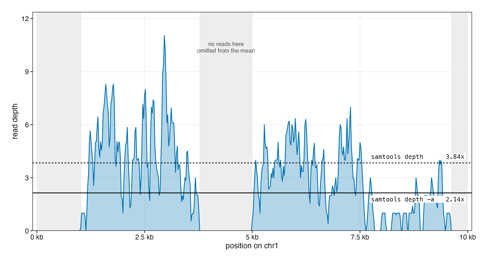
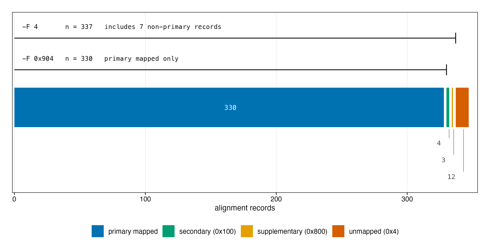
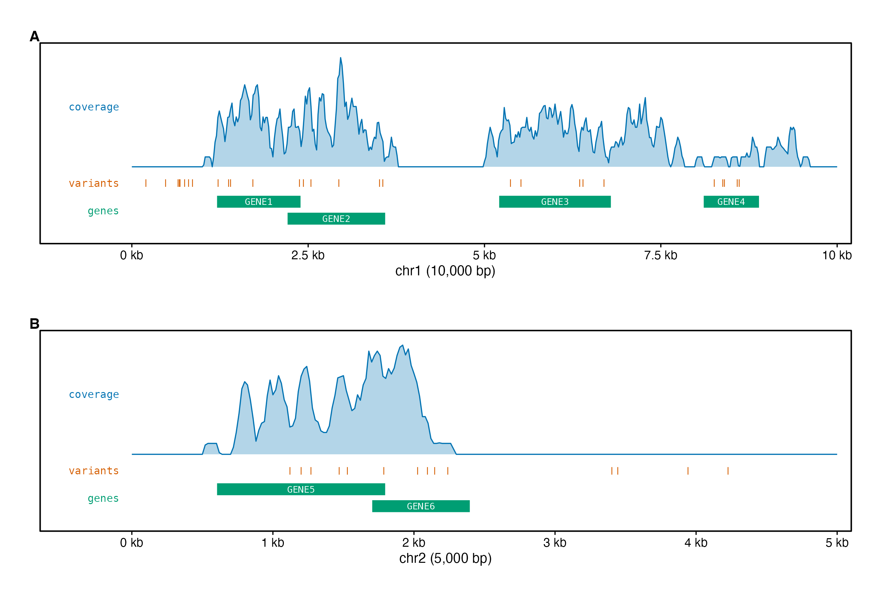
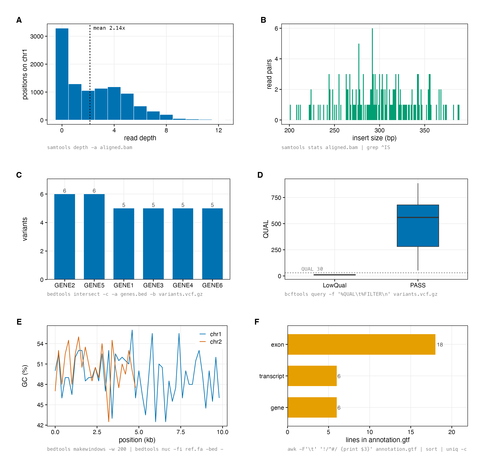

# Bioinformatics Bash Cookbook

**66 command-line recipes for genomic data, and the 43 traps they avoid.**

[](https://github.com/GeneticistHere/bioinformatics-bash-cookbook/actions/workflows/test.yml)
[](LICENSE)

Every command in this repository is executed against the included toy dataset
on every push. If a recipe here is wrong, the build goes red.



## Why another one-liner list

Most bioinformatics cheat sheets are copied from other cheat sheets, and a
surprising number of the commands in them are subtly wrong. They run, they
print a number, and the number is not what you think it is.

`samtools depth | awk '{s+=$3} END {print s/NR}'` is the classic: it looks like
mean coverage, but `samtools depth` omits zero-coverage positions, so it
reports mean depth *over covered bases only*. On the toy BAM in this
repository it returns **3.84×** where the true answer is **2.14×**, a 79%
overestimate, with no warning.



*Read depth across chr1 of the toy BAM. The dashed line is what `samtools
depth` reports; the solid line is the true mean over every position. The grey
bands are stretches with no reads, which the default command discards.*

The same thing happens when you count mapped reads. `-F 4` removes the
unmapped flag and nothing else, so every secondary and supplementary alignment
your aligner emitted is still in the count:



*All 349 alignment records in the toy BAM, split by class. `-F 4` keeps
everything except the unmapped records; `-F 0x904` also drops the secondary
and supplementary alignments.*

This cookbook pairs every recipe with the mistake it exists to avoid, and
tests all of them so the claims stay true.

## The ten traps worth knowing

<!-- BEGIN TRAPS -->

| # | What people write | What it should be | Why |
|---|-------------------|-------------------|-----|
| 1 | `samtools depth in.bam \| awk '{s+=$3} END {print s/NR}'` | `samtools depth -a in.bam \| awk '{s+=$3} END {print s/NR}'` | Without -a, samtools depth omits zero-coverage positions entirely, so dividing by NR gives mean depth over covered bases only (`B04`) |
| 2 | `samtools view -c -F 4 in.bam` | `samtools view -c -F 0x904 in.bam` | -F 4 also counts secondary (0x100) and supplementary (0x800) alignments, so it over-reports (`B02`) |
| 3 | `samtools fastq -f 4 in.bam > unmapped.fq` | `samtools fastq -f 4 -1 un_R1.fq -2 un_R2.fq -0 /dev/null -s /dev/null -n in.bam` | `samtools fastq -f 4 in.bam > out.fq` interleaves R1 and R2 into one file and drops singletons silently (`B07`) |
| 4 | `awk -F'\t' '$3=="gene" {print $9}' in.gtf \| awk -F';' '{print $1, $3}'` | `awk -F'\t' '$3=="gene" && match($9, /gene_name "[^"]+"/) {print substr($9, RSTART+11, RLENGTH-12)}' in.gtf` | Positional parsing (`cut -d';' -f3`) breaks on genes with no gene_name - common for novel and lncRNA genes - and silently returns gene_source instead (`G02`) |
| 5 | `samtools view in.bam \| wc -l` | `set -o pipefail; samtools view in.bam \| wc -l` | By default a pipeline reports only the LAST command's status, so a crashed samtools upstream of `wc -l` looks like success (`P06`) |
| 6 | `gzip -c in.vcf > in.vcf.gz && tabix -p vcf in.vcf.gz` | `bgzip -c in.vcf > in.vcf.gz && tabix -p vcf in.vcf.gz` | A plain `gzip` file cannot be indexed (`V12`) |
| 7 | `bedtools merge -i regions.bed` | `sort -k1,1 -k2,2n regions.bed \| bedtools merge -i -` | bedtools merge assumes sorted input (`D01`) |
| 8 | `seqtk sample -s100 R1.fq.gz 10000 > s1.fq; seqtk sample -s42 R2.fq.gz 10000 > s2.fq` | `seqtk sample -s100 R1.fq.gz 10000 > s1.fq; seqtk sample -s100 R2.fq.gz 10000 > s2.fq` | Using a different -s seed for R1 and R2 silently destroys pairing (`F03`) |
| 9 | `pigz -dc big.fq.gz \| wc -l` | `gzip -dc big.fq.gz \| wc -l   # same speed; use pigz -p N to COMPRESS` | pigz parallelises compression only (`P01`) |
| 10 | `sort -k1,1 -k2,2n big.bed \| join - ids.txt` | `LC_ALL=C sort -k1,1 -k2,2n big.bed \| LC_ALL=C join - ids.txt` | LC_ALL=C is a large speed-up but it changes collation order (`P03`) |

<!-- END TRAPS -->

## Quick start

```bash
git clone https://github.com/GeneticistHere/bioinformatics-bash-cookbook.git
cd bioinformatics-bash-cookbook
conda env create -f environment.yml
conda activate bash-cookbook
```

Every recipe runs against `dummy_data/`, which is committed to the repository
(300 KB total). Nothing to download, no reference genome, no waiting:

```bash
samtools view -c -F 0x904 dummy_data/aligned.bam     # 330
bcftools index -n dummy_data/variants.vcf.gz         # 42
samtools depth -a dummy_data/aligned.bam | awk '{s+=$3} END {print s/NR}'
```

Verify the whole cookbook on your machine:

```bash
python3 scripts/test_cookbook.py
```

## The toy dataset

`dummy_data/` is a miniature but fully valid genome, with real headers, real
indices and real binary formats, deliberately shaped so that every trap above
is *demonstrable* rather than hypothetical.



*The toy genome. (A) chr1 and (B) chr2, each showing read coverage, variant
positions and annotated genes. Overlapping genes are drawn on separate rows.*

| File | What it is |
|------|------------|
| `ref.fa`, `.fai` | Two contigs, chr1 (10 kb) and chr2 (5 kb) |
| `aligned.bam`, `.bai` | 349 records: 330 primary, plus secondary, supplementary, duplicate and unmapped reads |
| `aligned.sam` | The same alignments as readable text |
| `variants.vcf.gz`, `.tbi` | 42 variants over 3 samples: SNPs, indels, multi-allelic sites, PASS and LowQual |
| `reads_R1.fq.gz`, `reads_R2.fq.gz` | 171 read pairs |
| `genes.bed` | 6 genes, two overlapping pairs |
| `annotation.gtf` | The same genes with Ensembl-style attributes |
| `genome.txt` | Contig lengths for `bedtools` |

Design choices that make the traps visible:

- **chr1:4000-5000 has zero coverage**, so `samtools depth` and
  `samtools depth -a` disagree (3.84× vs 2.14×).
- **Secondary and supplementary alignments are present**, so `-F 4` returns
  337 where `-F 0x904` returns 330.
- **Two genes carry no `gene_name` attribute**, as novel and lncRNA genes
  routinely do, so positional GTF parsing silently returns the wrong field.
- **`genes.bed` contains overlapping features**, so `bedtools merge` has real
  work to do (6 features → 4 intervals).

Rebuild it from scratch with `bash scripts/build_dummy_data.sh`. The generator
is seeded, so the numbers above are stable.

## What the recipes return

Every panel below is the parsed standard output of one cookbook command, run
against `dummy_data/` when the figure was rendered.



*(A) Read-depth distribution from `samtools depth -a`. (B) Insert-size
distribution from `samtools stats`. (C) Variants per gene from `bedtools
intersect -c`. (D) QUAL by FILTER from `bcftools query`. (E) GC content in
200 bp windows from `bedtools makewindows` piped into `bedtools nuc`.
(F) Feature counts parsed out of the GTF with `awk`.*

## The cookbook

Recipes marked &#9888; carry a trap; expand the section below each table to
read it.

<!-- BEGIN COOKBOOK -->

### FASTQ & FASTA

14 recipes, 7 with traps.

| ID | Task | One-liner |
|----|------|-----------|
| `F01` &#9888; | Count reads and bases in a gzipped FASTQ in one pass | `seqtk size dummy_data/reads_R1.fq.gz` |
| `F02` &#9888; | Count reads without seqtk | `gzip -dc dummy_data/reads_R1.fq.gz \| awk 'END {print NR/4}'` |
| `F03` &#9888; | Subsample read pairs while keeping mates in sync | `seqtk sample -s100 dummy_data/reads_R1.fq.gz 50 > sub_R1.fq && seqtk sample -s100 dummy_data/reads_R2.fq.gz 50 > sub_R2.fq && echo 'pairs kept in sync'` |
| `F04` | Convert FASTQ to FASTA | `seqtk seq -a dummy_data/reads_R1.fq.gz \| head -2` |
| `F05` &#9888; | GC content of every sequence in a FASTA | `seqtk comp dummy_data/ref.fa \| awk '{printf "%s\t%.4f\n", $1, ($4+$5)/$2}'` |
| `F06` | Total assembly size and sequence count | `seqtk size dummy_data/ref.fa` |
| `F07` | Pull out sequences named in a list | `printf 'chr2\n' > ids.txt && seqtk subseq dummy_data/ref.fa ids.txt \| head -1` |
| `F08` &#9888; | Extract a genomic region from a FASTA | `samtools faidx dummy_data/ref.fa chr1:1001-1100` |
| `F09` | Reverse complement every sequence | `seqtk seq -r dummy_data/ref.fa \| head -1` |
| `F10` | Unwrap a FASTA to one line per record | `seqtk seq -l 0 dummy_data/ref.fa \| awk 'NR==2 {print length}'` |
| `F11` | Keep only sequences above a length threshold | `seqtk seq -L 6000 dummy_data/ref.fa \| grep -c '^>'` |
| `F12` &#9888; | Per-contig lengths without reading the FASTA at all | `cut -f1,2 dummy_data/ref.fa.fai` |
| `F13` | Interleave two paired FASTQ files | `seqtk mergepe dummy_data/reads_R1.fq.gz dummy_data/reads_R2.fq.gz \| awk 'END {print NR/4}'` |
| `F14` &#9888; | Strip a FASTQ down to read IDs | `gzip -dc dummy_data/reads_R1.fq.gz \| awk 'NR%4==1 {sub(/^@/, ""); print $1}' \| head -3` |

<details><summary><b>&#9888; Traps in this section (7)</b></summary>

- **`F01` Count reads and bases in a gzipped FASTQ in one pass**: `wc -l | awk '{print $1/4}'` decompresses the whole file just to count lines, and tells you nothing about bases.
- **`F02` Count reads without seqtk**: Piping into `wc -l` and dividing spawns an extra process and miscounts a file with no trailing newline.
- **`F03` Subsample read pairs while keeping mates in sync**: Using a different -s seed for R1 and R2 silently destroys pairing. The seed must be identical for both mates.
- **`F05` GC content of every sequence in a FASTA**: A hand-rolled awk GC counter mishandles wrapped (multi-line) records, keeps the '>' in the name, and divides by zero on blank lines. seqtk already counts every base.
- **`F08` Extract a genomic region from a FASTA**: samtools faidx coordinates are 1-based inclusive; BED is 0-based half-open. Feeding a BED start straight in shifts you one base.
- **`F12` Per-contig lengths without reading the FASTA at all**: Parsing a multi-gigabyte FASTA to measure contigs re-reads every base. The .fai index already stores the lengths.
- **`F14` Strip a FASTQ down to read IDs**: `grep '^@'` also matches quality lines that happen to start with '@', because '@' is a legal Phred score.

</details>

### VCF & BCF

13 recipes, 8 with traps.

| ID | Task | One-liner |
|----|------|-----------|
| `V01` &#9888; | Count variants instantly | `bcftools index -n dummy_data/variants.vcf.gz` |
| `V02` | List sample names | `bcftools query -l dummy_data/variants.vcf.gz` |
| `V03` &#9888; | Keep only PASS variants | `bcftools view -H -f PASS dummy_data/variants.vcf.gz \| wc -l` |
| `V04` &#9888; | Extract a genomic region | `bcftools view -H -r chr1:1200-2400 dummy_data/variants.vcf.gz \| wc -l` |
| `V05` | Flatten a VCF into a table | `bcftools query -f '%CHROM\t%POS\t%REF\t%ALT\t%QUAL\n' dummy_data/variants.vcf.gz \| head -3` |
| `V06` | Count SNPs and indels separately | `for t in snps indels; do printf '%s\t%s\n' "$t" "$(bcftools view -H -v $t dummy_data/variants.vcf.gz \| wc -l \| tr -d ' ')"; done` |
| `V07` &#9888; | Split multi-allelic sites into one row per allele | `bcftools norm -m -any -f dummy_data/ref.fa dummy_data/variants.vcf.gz 2>/dev/null \| grep -vc '^#'` |
| `V08` &#9888; | Filter on QUAL and depth together | `bcftools view -H -i 'QUAL>=30 && INFO/DP>=20' dummy_data/variants.vcf.gz \| wc -l` |
| `V09` | Dump a genotype matrix | `bcftools query -f '%CHROM\t%POS[\t%GT]\n' dummy_data/variants.vcf.gz \| head -3` |
| `V10` | Per-sample het, hom and missing counts | `bcftools stats -s - dummy_data/variants.vcf.gz \| grep '^PSC' \| cut -f3,5,6,14` |
| `V11` &#9888; | Subset samples and drop sites that are no longer variable | `bcftools view -s HG001,HG002 -a -H dummy_data/variants.vcf.gz \| wc -l` |
| `V12` &#9888; | Compress and index a plain VCF so it can be queried by region | `bgzip -c dummy_data/variants.vcf > out.vcf.gz && tabix -p vcf out.vcf.gz && echo indexed` |
| `V13` &#9888; | Variant count per chromosome | `bcftools query -f '%CHROM\n' dummy_data/variants.vcf.gz \| uniq -c` |

<details><summary><b>&#9888; Traps in this section (8)</b></summary>

- **`V01` Count variants instantly**: `bcftools view -H | wc -l` decompresses and parses every record. The index already stores the count.
- **`V03` Keep only PASS variants**: -f matches the FILTER column, so `-f PASS` also keeps '.' (filters not applied). Use -i 'FILTER=="PASS"' to be strict.
- **`V04` Extract a genomic region**: -r jumps via the index and fails without one; -t streams the whole file instead. Also check your coordinates match the assembly the VCF was called against.
- **`V07` Split multi-allelic sites into one row per allele**: Allele frequencies and genotype counts computed over packed multi-allelic rows are wrong. Normalise before you count.
- **`V08` Filter on QUAL and depth together**: INFO/DP and FORMAT/DP are different fields. Unqualified 'DP' in an expression is ambiguous - always say which one you mean.
- **`V11` Subset samples and drop sites that are no longer variable**: Subsetting samples leaves AC/AN stale. -a trims unseen alleles; add `+fill-tags` if you need the INFO counts recomputed.
- **`V12` Compress and index a plain VCF so it can be queried by region**: A plain `gzip` file cannot be indexed. bgzip writes block-gzip, which every tool reads as normal gzip but tabix can seek into.
- **`V13` Variant count per chromosome**: `sort | uniq -c` on a coordinate-sorted VCF is wasted work - the chromosomes already arrive grouped.

</details>

### BAM & SAM

15 recipes, 11 with traps.

| ID | Task | One-liner |
|----|------|-----------|
| `B01` | Count every alignment record | `samtools view -c dummy_data/aligned.bam` |
| `B02` &#9888; | Count primary mapped reads | `samtools view -c -F 0x904 dummy_data/aligned.bam` |
| `B03` | Full mapping summary | `samtools flagstat dummy_data/aligned.bam \| head -6` |
| `B04` &#9888; | Mean depth across the whole reference | `samtools depth -a dummy_data/aligned.bam \| awk '{s+=$3} END {print s/NR}'` |
| `B05` &#9888; | Coverage, depth and breadth per contig | `samtools coverage dummy_data/aligned.bam` |
| `B06` &#9888; | Extract a region as BAM | `samtools view -b dummy_data/aligned.bam chr1:1200-2400 > region.bam && samtools view -c region.bam` |
| `B07` &#9888; | Recover unmapped reads as paired FASTQ | `samtools fastq -f 4 -1 un_R1.fq -2 un_R2.fq -0 /dev/null -s /dev/null -n dummy_data/aligned.bam 2>/dev/null && awk 'END {print NR/4}' un_R1.fq` |
| `B08` &#9888; | Sort and index in a single pass | `samtools sort --write-index -o sorted.bam dummy_data/aligned.sam 2>/dev/null && ls sorted.bam.csi` |
| `B09` &#9888; | Count PCR duplicates | `samtools view -c -f 1024 dummy_data/aligned.bam` |
| `B10` &#9888; | Filter by mapping quality | `samtools view -c -q 30 dummy_data/aligned.bam` |
| `B11` &#9888; | Reads per chromosome, read from the index | `samtools idxstats dummy_data/aligned.bam` |
| `B12` | Insert size summary | `samtools stats dummy_data/aligned.bam \| grep '^SN' \| grep 'insert size'` |
| `B13` &#9888; | Convert BAM to CRAM | `samtools view -T dummy_data/ref.fa -C -o out.cram dummy_data/aligned.bam && samtools view -c out.cram` |
| `B14` | Read the header / contig list | `samtools view -H dummy_data/aligned.bam \| grep '^@SQ'` |
| `B15` &#9888; | Deterministic downsample | `samtools view -c -s 42.5 dummy_data/aligned.bam` |

<details><summary><b>&#9888; Traps in this section (11)</b></summary>

- **`B02` Count primary mapped reads**: -F 4 also counts secondary (0x100) and supplementary (0x800) alignments, so it over-reports. On this toy BAM: 337 vs 330.
- **`B04` Mean depth across the whole reference**: Without -a, samtools depth omits zero-coverage positions entirely, so dividing by NR gives mean depth over covered bases only. On this toy BAM that is 3.84x instead of the true 2.14x.
- **`B05` Coverage, depth and breadth per contig**: This is the purpose-built tool. Reach for it before hand-rolling awk over `samtools depth`.
- **`B06` Extract a region as BAM**: Region queries need the .bai next to the .bam. Without it samtools reads the entire file or refuses outright.
- **`B07` Recover unmapped reads as paired FASTQ**: `samtools fastq -f 4 in.bam > out.fq` interleaves R1 and R2 into one file and drops singletons silently. Always give -1/-2/-0/-s.
- **`B08` Sort and index in a single pass**: `samtools sort && samtools index` re-reads the entire sorted BAM. --write-index builds the index during the sort.
- **`B09` Count PCR duplicates**: This counts reads already flagged by markdup. samtools does not detect duplicates as a side effect of counting them.
- **`B10` Filter by mapping quality**: MAPQ scales differ between aligners. BWA's 0 means multi-mapping; a MAPQ 30 cut means different things across tools.
- **`B11` Reads per chromosome, read from the index**: Counting per chromosome with `view -c` scans the alignments. idxstats reads only the index and returns instantly.
- **`B13` Convert BAM to CRAM**: CRAM is reference-compressed. Lose the exact reference FASTA and you may not be able to decode the file again.
- **`B15` Deterministic downsample**: -s takes SEED.FRACTION as a single number. `-s 0.1` is seed 0 at 10%, which is rarely what people think they wrote.

</details>

### BED & region math

10 recipes, 6 with traps.

| ID | Task | One-liner |
|----|------|-----------|
| `D01` &#9888; | Merge overlapping intervals | `sort -k1,1 -k2,2n dummy_data/genes.bed \| bedtools merge -i - \| wc -l` |
| `D02` &#9888; | Variants that fall inside annotated genes | `bedtools intersect -a dummy_data/variants.vcf.gz -b dummy_data/genes.bed -u -header \| grep -vc '^#'` |
| `D03` | Count variants per gene | `bedtools intersect -c -a dummy_data/genes.bed -b dummy_data/variants.vcf.gz` |
| `D04` | Pull the sequence of every interval | `bedtools getfasta -fi dummy_data/ref.fa -bed dummy_data/genes.bed -name \| head -1` |
| `D05` &#9888; | Find the regions with no annotation | `bedtools complement -i dummy_data/genes.bed -g dummy_data/genome.txt \| wc -l` |
| `D06` | Read coverage over each gene | `bedtools coverage -a dummy_data/genes.bed -b dummy_data/aligned.bam \| cut -f4,7,8,10` |
| `D07` &#9888; | Nearest gene to every variant | `bedtools closest -a dummy_data/variants.vcf.gz -b dummy_data/genes.bed 2>/dev/null \| head -2` |
| `D08` &#9888; | Total bases covered by a BED file | `awk '{s += $3 - $2} END {print s}' dummy_data/genes.bed` |
| `D09` &#9888; | Extend intervals without running off the contig | `bedtools slop -b 500 -i dummy_data/genes.bed -g dummy_data/genome.txt \| head -2` |
| `D10` | Subtract one interval set from another | `bedtools subtract -a dummy_data/genes.bed -b dummy_data/variants.vcf.gz \| wc -l` |

<details><summary><b>&#9888; Traps in this section (6)</b></summary>

- **`D01` Merge overlapping intervals**: bedtools merge assumes sorted input. Give it unsorted intervals and it returns wrong output without an error.
- **`D02` Variants that fall inside annotated genes**: Without -u, a variant overlapping two genes is emitted once per overlap, quietly inflating your counts.
- **`D05` Find the regions with no annotation**: complement needs a genome file of contig lengths. Build it straight from the .fai: cut -f1,2 ref.fa.fai > genome.txt
- **`D07` Nearest gene to every variant**: closest needs both inputs sorted the same way, and reports distance 0 for anything overlapping.
- **`D08` Total bases covered by a BED file**: Correct for BED because it is 0-based half-open. The same arithmetic on a GTF is off by one per feature - GTF is 1-based inclusive and needs end-start+1.
- **`D09` Extend intervals without running off the contig**: Adding flanks with awk produces negative starts and coordinates past the contig end. slop clamps them because it knows the sizes.

</details>

### GTF & GFF

7 recipes, 4 with traps.

| ID | Task | One-liner |
|----|------|-----------|
| `G01` | Count features by type | `awk -F'\t' '!/^#/ {print $3}' dummy_data/annotation.gtf \| sort \| uniq -c \| sort -rn` |
| `G02` &#9888; | Extract gene_id and gene_name reliably | `awk -F'\t' '$3=="gene" { id=nm="NA"; if (match($9, /gene_id "[^"]+"/)) id=substr($9, RSTART+9, RLENGTH-10); if (match($9, /gene_name "[^"]+"/)) nm=substr($9, RSTART+11, RLENGTH-12); print id "\t" nm }' dummy_data/annotation.gtf` |
| `G03` &#9888; | Convert GTF genes to BED | `awk -F'\t' '$3=="gene" {print $1 "\t" ($4-1) "\t" $5}' dummy_data/annotation.gtf \| head -3` |
| `G04` | Exon count per gene | `awk -F'\t' '$3=="exon" { if (match($9, /gene_id "[^"]+"/)) print substr($9, RSTART+9, RLENGTH-10) }' dummy_data/annotation.gtf \| sort \| uniq -c` |
| `G05` &#9888; | Exonic length per gene, without double counting | `awk -F'\t' '$3=="exon" { if (match($9, /gene_id "[^"]+"/)) print $1 "\t" ($4-1) "\t" $5 "\t" substr($9, RSTART+9, RLENGTH-10) }' dummy_data/annotation.gtf \| sort -k1,1 -k2,2n \| bedtools merge -i - -c 4 -o distinct \| awk '{len[$4] += $3-$2} END {for (g in len) print g "\t" len[g]}' \| sort` |
| `G06` &#9888; | List every attribute key present in the file | `grep -v '^#' dummy_data/annotation.gtf \| cut -f9 \| tr ';' '\n' \| awk 'NF {print $1}' \| sort \| uniq -c \| sort -rn` |
| `G07` | Genes on one strand within a region | `awk -F'\t' '$1=="chr1" && $3=="gene" && $7=="+" && $4 < 4000 {print $1, $4, $5, $7}' dummy_data/annotation.gtf` |

<details><summary><b>&#9888; Traps in this section (4)</b></summary>

- **`G02` Extract gene_id and gene_name reliably**: Positional parsing (`cut -d';' -f3`) breaks on genes with no gene_name - common for novel and lncRNA genes - and silently returns gene_source instead. Match on the key, never the position.
- **`G03` Convert GTF genes to BED**: GTF is 1-based inclusive, BED is 0-based half-open. The start must lose exactly one base; the end must not.
- **`G05` Exonic length per gene, without double counting**: Summing exon lengths straight from the GTF double-counts exons shared between transcripts of the same gene. Merge first.
- **`G06` List every attribute key present in the file**: Do this before writing any parser. Attribute sets differ between Ensembl, GENCODE and NCBI, and between feature types in one file.

</details>

### Compression, search & pipeline hygiene

7 recipes, 7 with traps.

| ID | Task | One-liner |
|----|------|-----------|
| `P01` &#9888; | Compress with all your cores | `pigz -p 4 -c dummy_data/ref.fa \| wc -c` |
| `P02` &#9888; | Compress so you can seek into the file later | `bgzip -c -@ 2 dummy_data/variants.vcf > p.vcf.gz && tabix -p vcf p.vcf.gz && tabix p.vcf.gz chr1:1200-2400 \| wc -l` |
| `P03` &#9888; | Sort large files much faster | `LC_ALL=C sort -k1,1 -k2,2n -S 512M dummy_data/genes.bed \| head -2` |
| `P04` &#9888; | Search inside compressed files without decompressing first | `rg -z -c 'READ00001' dummy_data/reads_R1.fq.gz` |
| `P05` &#9888; | Let awk open the file itself | `awk 'END {print NR}' dummy_data/genes.bed` |
| `P06` &#9888; | Make a pipeline fail when any stage fails | `(set -o pipefail; samtools view /no/such/file.bam 2>/dev/null \| wc -l > /dev/null; echo "exit=$?")` |
| `P07` &#9888; | Stream through a pipeline without temporary files | `samtools view -u -F 0x904 dummy_data/aligned.bam \| samtools sort -o /dev/null - 2>/dev/null && echo streamed` |

<details><summary><b>&#9888; Traps in this section (7)</b></summary>

- **`P01` Compress with all your cores**: pigz parallelises compression only. Gzip *decompression* is inherently serial, so `pigz -dc` is barely faster than `gzip -dc` - it is not the speed-up people expect.
- **`P02` Compress so you can seek into the file later**: Random access needs block-gzip. bgzip output stays readable by gzip and zcat, so there is no reason to use plain gzip for anything you will query later.
- **`P03` Sort large files much faster**: LC_ALL=C is a large speed-up but it changes collation order. Use it consistently across every sort in a pipeline, or `join`, `comm` and `bedtools` will silently mismatch.
- **`P04` Search inside compressed files without decompressing first**: ripgrep's real advantage is recursive multi-file search. On a single plain file grep is just as fast.
- **`P05` Let awk open the file itself**: `cat file | awk ...` forks an extra process and throws away FILENAME and FNR, which awk needs for multi-file work.
- **`P06` Make a pipeline fail when any stage fails**: By default a pipeline reports only the LAST command's status, so a crashed samtools upstream of `wc -l` looks like success. This is the single most common silent-failure bug in bioinformatics shell scripts.
- **`P07` Stream through a pipeline without temporary files**: -u writes uncompressed BAM between processes. Compressing intermediate output just to decompress it again wastes CPU.

</details>

<!-- END COOKBOOK -->

## How this repository is put together

`scripts/recipes.py` is the single source of truth. The README tables and the
test suite are both generated from it, so a recipe cannot be documented one way
and tested another.

```
recipes.py ──┬── render_readme.py ──> the tables above
             └── test_cookbook.py ──> CI
```

| File | Purpose |
|------|---------|
| `scripts/recipes.py` | Every recipe, its trap and its expected output |
| `scripts/test_cookbook.py` | Runs each recipe in a scratch directory, checks the result |
| `scripts/render_readme.py` | Regenerates the tables above |
| `scripts/make_dummy_data.py` | Writes the plain-text toy data (pure Python) |
| `scripts/build_dummy_data.sh` | Compiles it into indexed BAM/VCF |
| `scripts/make_figures.R` | Rebuilds the figures from the toy data (ggplot2) |
| `scripts/make_cheatsheet.py` | Rebuilds the cheat sheet from the `HERO` list |
| `scripts/make_carousel.py` | Rebuilds the 12-page carousel PDF from the same list |

The figures are generated too. `make_figures.R` calls samtools and bcftools on
`dummy_data/` at render time rather than hard-coding any number, and
`make_cheatsheet.py` reads the same `HERO` list the README table is built from,
so a corrected recipe propagates to the images on the next run:

```bash
Rscript scripts/make_figures.R        # needs ggplot2, patchwork, ragg
python3 scripts/make_cheatsheet.py    # needs Chrome to rasterise
python3 scripts/make_carousel.py      # needs Chrome to rasterise
```

## Contributing

Pull requests welcome, especially ones that add a trap.

1. Add an entry to `RECIPES` in `scripts/recipes.py`, including an `expect`.
2. Run `python3 scripts/test_cookbook.py`. It must pass.
3. Run `python3 scripts/render_readme.py` to regenerate the tables.
4. Open the PR. CI runs both checks.

A recipe that cannot be tested against `dummy_data/` probably needs a small
addition to the toy dataset. That is fine, just say so in the PR.

## License

[MIT](LICENSE). The toy dataset is randomly generated and contains no real
genomic data of any kind.
